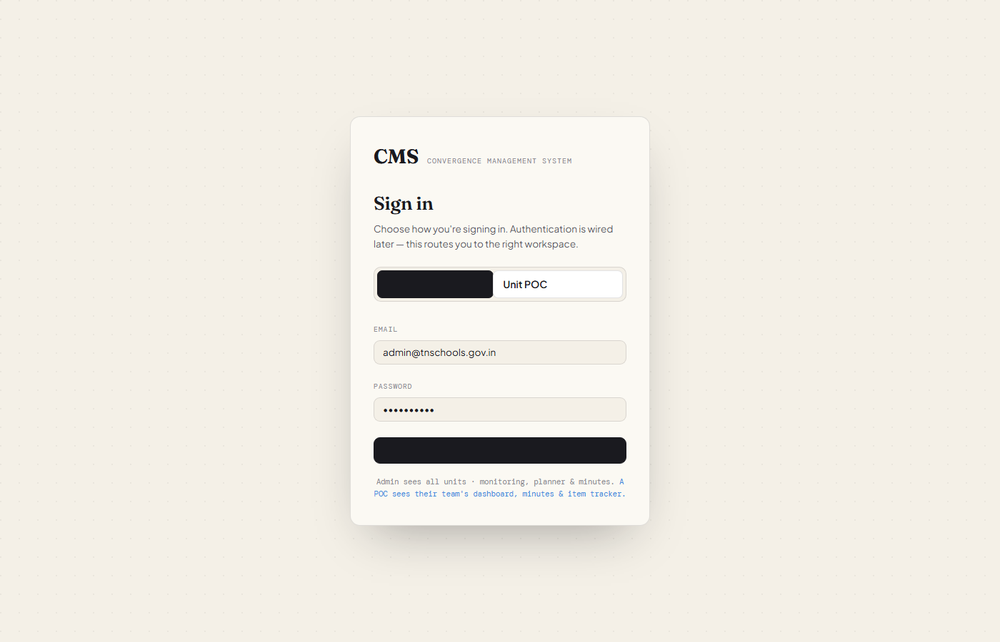
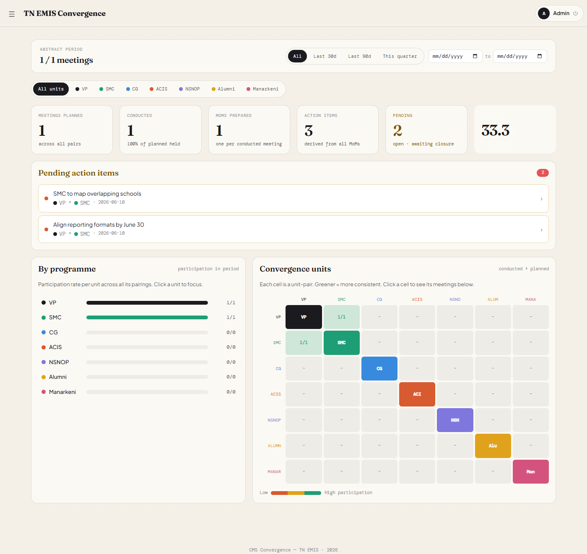
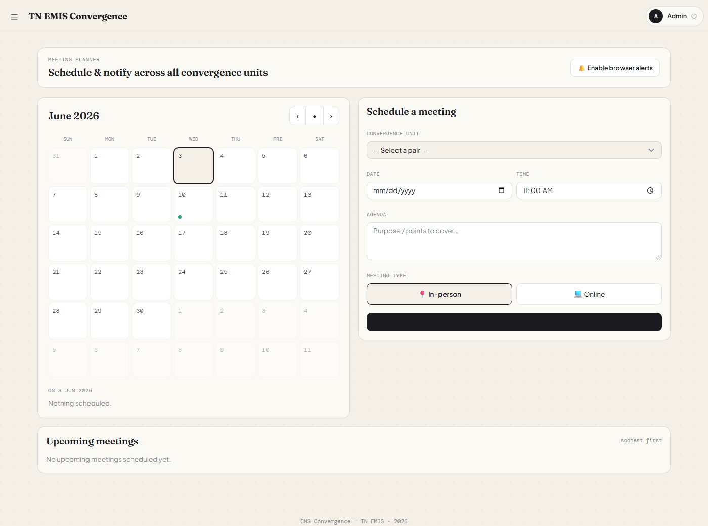
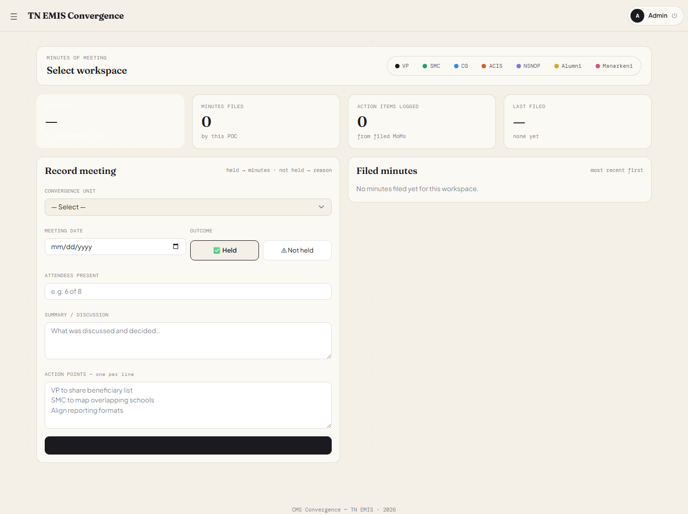
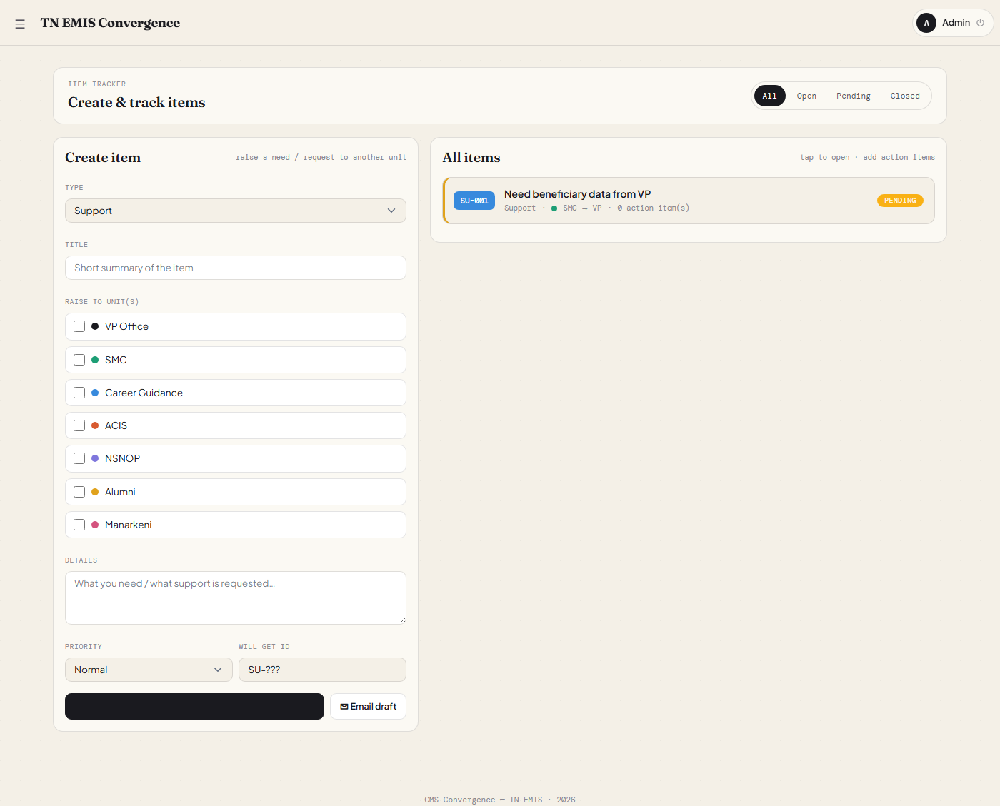

# MS-CMS 2026 — TN EMIS Convergence Management System

A full-stack web application for managing inter-unit convergence across **7 units** and **21 unit-pairs** under TN EMIS (Tamil Nadu Education Management Information System).

---

## Screenshots

| Login | Dashboard |
|-------|-----------|
|  |  |

| Meeting Planner | Minutes of Meeting |
|-----------------|--------------------|
|  |  |

| Item Tracker |
|--------------|
|  |

---

## Features

- **Meeting Planner** — Schedule meetings across all 21 unit-pairs with agenda and rescheduling
- **Minutes of Meeting** — File MoMs with attendees, summary, and action points; export as PDF or Word; share via WhatsApp
- **Item Tracker** — Log, assign, and close action items with priority and status tracking
- **D.O. Letters** — Upload and archive official correspondence with year-based filtering
- **KPI Dashboard** — Track key performance indicators per unit
- **Work Log** — Log daily tasks and hours per unit
- **Convergence Matrix** — 7×7 health grid showing pair-wise meeting progress
- **Role-based access** — `admin` sees everything; each `poc` sees only their unit's data
- **Notifications** — In-app alerts for new meetings, items, and minutes

---

## Tech Stack

| Layer | Technology |
|-------|-----------|
| Backend | Django 5.2, Django REST Framework 3.15, SimpleJWT |
| Database | MySQL 8 |
| Frontend | React 19, Vite, TanStack Query v5, React Router 6 |
| UI | CoreUI 4, custom CSS tokens |
| Auth | JWT (access + refresh tokens, auto-refresh interceptor) |
| Export | jsPDF, docx |

---

## Units

| Abbr | Name |
|------|------|
| VP | VETRI Palligal |
| SMC | SMC |
| CG | Career Guidance |
| ACIS | ACIS |
| NSNOP | NSNOP |
| Alumni | Alumni |
| Man | Manarkeni |

---

## Getting Started

### Prerequisites

- Python 3.11+
- Node.js 18+
- MySQL 8

### Backend Setup

```bash
cd backend

# Create and activate virtual environment
python -m venv venv
source venv/bin/activate        # Windows: venv\Scripts\activate

# Install dependencies
pip install -r requirements.txt

# Configure environment
cp .env.example .env
# Edit .env with your DB credentials and SECRET_KEY

# Run migrations
python manage.py migrate

# Seed units, pairs, and default users
python manage.py seed_data

# Start dev server
python manage.py runserver
```

### Frontend Setup

```bash
cd frontend

npm install
npm run dev
```

Frontend runs at `http://localhost:5173`, proxying API calls to `http://localhost:8000`.

---

## Default Credentials

> Change all passwords before deploying to production.

| Role | Username | Password |
|------|----------|----------|
| Admin | `admin` | `Admin@1234` |
| VP POC | `poc_vp` | `Poc@1234` |
| SMC POC | `poc_smc` | `Poc@1234` |
| CG POC | `poc_cg` | `Poc@1234` |
| ACIS POC | `poc_acis` | `Poc@1234` |
| NSNOP POC | `poc_nsnop` | `Poc@1234` |
| Alumni POC | `poc_alum` | `Poc@1234` |
| Manarkeni POC | `poc_man` | `Poc@1234` |

---

## Project Structure

```
MS-CMS-2026/
├── backend/
│   ├── apps/
│   │   ├── accounts/       # User model, JWT auth, permissions
│   │   ├── units/          # ConvergenceUnit, UnitPair models
│   │   ├── meetings/       # Meeting scheduling and MoM filing
│   │   ├── items/          # Action item tracker
│   │   ├── documents/      # D.O. letter uploads
│   │   ├── kpi/            # KPI entries
│   │   ├── worklog/        # Work task logging
│   │   ├── notifications/  # In-app notification system
│   │   └── menus/          # Custom menu configuration
│   ├── cms/
│   │   ├── settings.py
│   │   ├── urls.py
│   │   └── middleware.py   # DB error handling middleware
│   ├── manage.py
│   └── requirements.txt
└── frontend/
    ├── src/
    │   ├── api/            # Axios API client and per-feature helpers
    │   ├── components/     # Shared UI components
    │   ├── context/        # Auth and Toast context providers
    │   ├── pages/          # One file per route/feature
    │   ├── styles/         # CSS tokens and component styles
    │   └── utils/          # PDF/Word export helpers
    ├── public/
    ├── index.html
    └── vite.config.js
```

---

## License

Internal use — TN EMIS Convergence Programme 2026.
